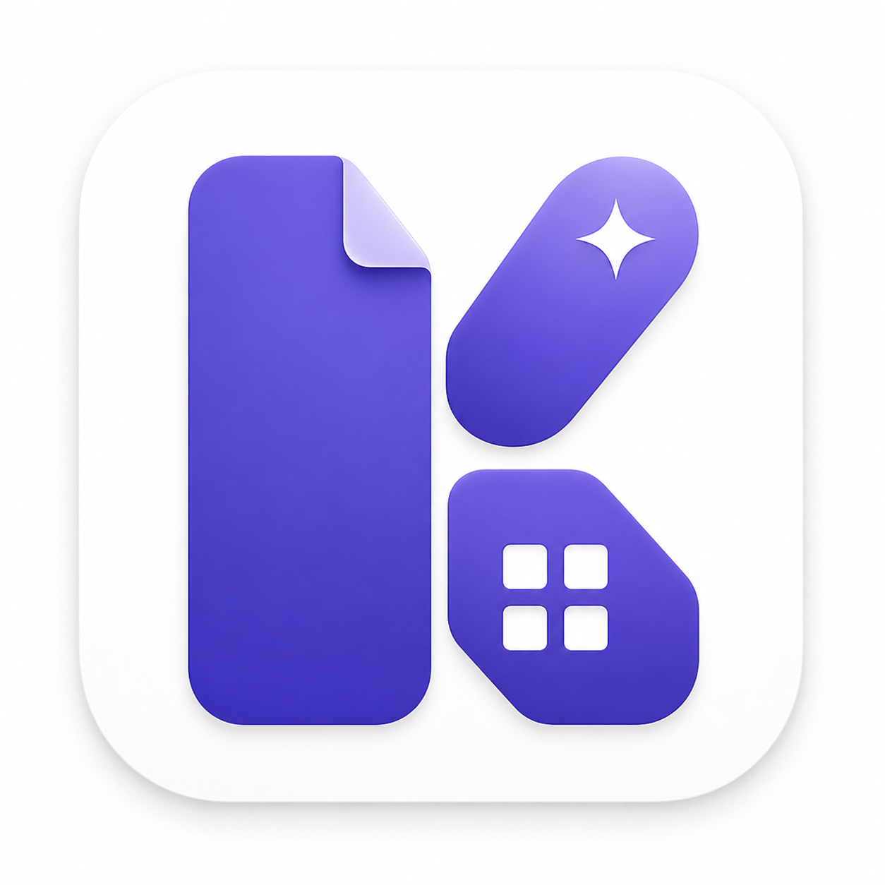

<p align="center">
  
</p>

<h1 align="center">Kition</h1>

<p align="center">
  <strong>A local-first AI workspace for notes, structured data, and autonomous work.</strong>
</p>

<p align="center">
  Markdown documents · Notion-style tables · An AI agent that can actually use tools — all running against a vault on your own machine.
</p>

<p align="center">
  <a href="https://kition.ai"><b>Website</b></a> ·
  <a href="https://github.com/KotionAI/kition-release/releases/latest"><b>Download</b></a> ·
  <a href="https://github.com/KotionAI/kition-release/issues"><b>Issues</b></a>
</p>

---

## Download

Grab the latest desktop installer from the [Releases](https://github.com/KotionAI/kition-release/releases/latest) page.

| Platform | Installer |
| --- | --- |
| macOS (Apple Silicon) | `Kition-<version>-arm64.dmg` |
| Windows (x64) | `Kition-Setup-<version>.exe` |

Auto-update metadata (`latest*.yml`, `*.blockmap`) ships alongside the installers so updates are delivered in place.

> macOS Intel and Linux builds are not currently published. If you need them, please open an issue.

## What Kition Is

Kition brings three primitives into a single desktop workspace:

| Primitive | What it gives you |
| --- | --- |
| **Markdown documents** | Plain `.md` files on disk, edited with a CodeMirror 6 surface — live preview, `[[wikilinks]]`, backlinks, embeds, callouts, math, Mermaid, and a command palette. |
| **Structured tables** | Notion-style fields, views, and records that live next to your documents in the same vault. Great for content calendars, CRMs, task boards, research indexes, asset libraries. |
| **AI agent** | A tool-using agent that reads and writes files, applies edits as reviewable patches, runs shell commands, drives a real Chromium browser, queries MCP servers, and operates on your tables. |

Everything sits in a normal folder you choose. No proprietary file format. No cloud sync requirement. No account needed for the base flow.

## Highlights

- **Local-first by default** — your vault is a directory on your disk. Open it later in Obsidian, VS Code, or any editor. Back it up with Git, Time Machine, iCloud, OneDrive, anything you already trust.
- **Real Markdown, not blocks** — what you save is what's on disk. No JSON ↔ Markdown round-trips, no lock-in.
- **Tables that the agent can read and write** — text, rich text, number, date, select, multi-select, URL, attachment, formula, and AI fields; Grid / Kanban / Gallery / Calendar views; CSV in and out.
- **An agent built as a workspace operator** — not a sidebar chat. Plans and goals, reviewable file patches, a real browser session for sites that need JavaScript or login, MCP, hooks, and subagents.
- **Bring your own model** — OpenAI / OpenAI-compatible (Responses API) and Anthropic (Messages API, with hosted `web_search`). Your keys, your provider.
- **Extensible** — connect MCP servers (GitHub, Linear, Notion, Postgres, Slack, internal APIs), add lifecycle hooks, run subagents for parallel research or review, add custom local tools.

## Features in Detail

### Local-first vaults

- Documents are plain Markdown files on disk.
- Tables are portable Kition table files; CSV import and export are first-class.
- Vaults can live anywhere — back them up the way you already back up files.
- No cloud account is required for the base desktop flow.

### Markdown editor

- Live preview with an Obsidian-style writing experience.
- `[[wikilinks]]`, backlinks, embeds, callouts, math, Mermaid diagrams, code blocks.
- Command palette and Markdown toolbar.
- Same vault opens cleanly in Obsidian, VS Code, Vim, or any text editor.

### Structured data tables

- Field types: text, rich text, number, date, select, multi-select, URL, attachment, formula, AI fields.
- Views: Grid, Kanban, Gallery, Calendar.
- Inline document references and table embeds.
- Records are first-class targets for the agent — it can read schemas, query rows, draft records, and add fields.

## AI Capabilities

Kition's AI surface is built in layers, so you can start with single-field generation and grow into multi-step agent workflows without leaving the vault.

### AI fields (per-row, per-cell automation)

Add an `ai` field to any table and pick an action. Generation runs per-row on demand or in batch, and can optionally auto-update when a source field changes.

| Action | What it does |
| --- | --- |
| `summarize` | Condense a source cell (or set of cells) into a short summary. |
| `translate` | Translate to a target language; configurable per field. |
| `extract` | Pull structured values from text using an instruction or JSON schema. |
| `improve` | Rewrite a draft cell — tone, clarity, length. |
| `customize` | Run a free-form prompt with `{{field}}` references; great for column-level generators. |
| `text_generation` | Source-less generation driven entirely by a custom prompt. |
| `image_customization` | Generate or transform an image asset for the row. |

Options include batch fill, per-row regenerate, `auto_update` on dependency change, and reference-cell mentions inside prompts.

### Agent tool inventory

The agent is registered with a real tool inventory across these categories — not a chat shim:

| Category | Tools |
| --- | --- |
| **Plan / goal** | `update_plan`, `get_goal`, `create_goal`, `update_goal` |
| **Execution** | `exec_command`, `write_stdin`, `apply_patch` (per-environment) |
| **Filesystem** | `fs_read`, `fs_stat`, `fs_list`, `fs_mkdir`, `fs_remove`, `fs_copy`, `file_search` |
| **Documents / artifacts** | `document_read/write/search/list`, `artifact_write`, `register_artifact`, `view_image`, `image_search`, `save_image_asset` |
| **Web / browser** | `web_search`, `web_fetch`, `web_article_save`, `browser_open/navigate/search`, plus deferred site-adapter tools surfaced via `tool_search` |
| **Data tables** | `data_table_create`, `data_table_schema`, `data_table_records`, `data_table_record_draft`, `data_table_add_fields`, `data_table_add_records` |
| **Interactive** | `request_user_input`, `request_permissions` (pause the loop with explicit interrupts) |
| **Collab / subagents** | `spawn_agent`, `send_input/message`, `wait_agent`, `close_agent`, `list_agents`, `resume_agent` (depth ≤ 2, ≤ 4 active per session) |
| **Discovery** | `tool_search` — free-form keyword query into the registry; boosts deferred tools 1.25× |
| **MCP** | `list_mcp_resources`, `list_mcp_resource_templates`, `read_mcp_resource` |

Tool exposure is tiered (`direct` / `deferred` / `direct_model_only` / `hidden`) so the model's visible spec stays focused; deferred tools come back via `tool_search` when the task needs them.

### Browser intelligence with site adapters

The desktop bundles a real Chromium session with retained logins. On top of it, a registry of site adapters lets the agent open the right surface and extract structured records:

| Adapter | Commands |
| --- | --- |
| `generic-web` (default) | `open`, `extract-list`, `extract-detail` |
| `xiaohongshu` | `search`, `feed`, `user`, `note`, `comments`, `creator-notes` |
| `twitter` | `search`, `timeline`, `profile`, `thread`, `bookmarks` |
| `tiktok` | `search`, `profile`, `video` |
| `reddit` | `search`, `subreddit`, `read`, `user` |
| `weibo` | `hot`, `search`, `user`, `post` |
| `youtube` | `search`, `video`, `channel`, `comments` |
| `douyin` | `profile`, `videos`, `video` |
| `linkedin` | `search`, `timeline` |
| `google` | `search`, `news` |

The agent uses `browser_context_entities` and `browser_ingest_strategy` to decide whether the current page is suited for list ingest, detail ingest, or further navigation — then writes the result straight into a table via `data_table_*` tools.

### Goals, plans, and budgets

- `create_goal` / `update_goal` track multi-step objectives separately from the chat turn.
- Per-goal **token and time budgets** are enforced automatically through the tool loop, so a runaway loop hits a budget instead of your wallet.
- `update_plan` lets the agent publish a visible plan; users can interrupt and redirect it.

### Subagents (parallel work)

The agent can spawn child agents for parallel research, review, or batch work:

- `spawn_agent`, `send_input`, `send_message`, `wait_agent`, `close_agent`, `list_agents`, `resume_agent`
- Depth limited to ≤ 2 and ≤ 4 active subagents per session — bounded fan-out, never an infinite tree.

### Hooks (shell-based extension points)

Configure shell hooks per vault at `<vault>/.kition/hooks.json` to inject policy, observability, or extra context — no code changes required.

- Events: `PreToolUse`, `PostToolUse`, `SessionStart`, `Stop`, `UserPromptSubmit`
- Per-hook `timeout_sec`, `match.tools`, `match.permissions`, `env`
- Tool aliases compose with concrete names: `Bash`, `Read`, `Write`, `Edit`, `WebFetch`, `WebSearch`, `Browser`, `DataTable`, `Plan`, `Image`, `Goal`, `Interactive`, `Collab`, `MCP`

### Bring your own model

Two wire APIs are supported end-to-end (same dispatch path for AI fields, writing flows, and the agent):

- `responses` — OpenAI Responses API (covers OpenAI and OpenAI-compatible custom providers).
- `anthropic_messages` — Anthropic Messages API, with hosted `web_search`.

Legacy `chat_completions` is intentionally not supported — providers configured that way are rejected at runtime so AI fields, writing flows, and the agent behave identically across providers.

## Who It's For

- **Knowledge workers** who already think in Markdown vaults but want a co-located agent that can actually edit files and run tools, not just chat.
- **Writers and creators** who want drafts, research, outlines, calendars, and AI assistance in one vault.
- **Researchers** who need Markdown notes, structured reading lists, citations, and summarization workflows.
- **Developers and tinkerers** who want a local AI workbench — bring your own model, write your own hooks, ship custom tools.
- **Small teams and agencies** managing client docs, content calendars, asset libraries, and lightweight CRMs.

## Getting Started

1. Download the installer for your platform from [Releases](https://github.com/KotionAI/kition-release/releases/latest) and run it.
2. On first launch, choose or create a local folder as your vault. Existing Markdown folders work.
3. Open **Settings → Providers** and add an API key for at least one provider (OpenAI / OpenAI-compatible, or Anthropic). Pick a default model.
4. Start writing documents, creating tables, or asking the agent to work inside your vault.

No account is required for the base desktop flow. AI calls go to whatever provider you configured.

## Where Your Data Lives

Kition uses native system directories.

| | macOS |
| --- | --- |
| App data | `~/Library/Application Support/Kition` |
| Cache | `~/Library/Caches/Kition` |
| Logs | `~/Library/Logs/Kition` |
| Runtime config | `~/.kition/config.toml` (written on first launch if missing) |

On Windows, the equivalent paths under `%AppData%`, `%LocalAppData%`, and `%UserProfile%\.kition\` are used.

Your vault files stay in whatever directory you opened — Kition never copies them out.

For troubleshooting, the embedded API's stdout/stderr are mirrored to `desktop-api.log` in the logs directory.

## Data and Privacy

Kition is built around local ownership.

- Your vault stays in the directory you chose. Markdown files remain plain `.md`.
- API keys are stored through the operating system credential store.
- The desktop app does not require cloud sync to operate.
- Features that call an AI provider or fetch web content will send the relevant prompt, context, or request to the provider you configured. Nothing else leaves your machine by default.

## Platform Support

| OS | Status |
| --- | --- |
| macOS 12+ (Apple Silicon) | Released |
| Windows 10/11 (x64) | Released |
| macOS (Intel) | Not currently built |
| Linux | Not currently built |

If you need an unbuilt target, open an [issue](https://github.com/KotionAI/kition-release/issues) and we'll prioritize accordingly.

## About This Repository

This repo is the public home for Kition desktop **releases** and distribution. It hosts:

- Signed installers and auto-update metadata, via [Releases](https://github.com/KotionAI/kition-release/releases).
- The packaging workflow that builds those installers from the upstream source.
- Public-facing assets and this README.

Application source code lives in a separate repository owned by the Kition team and is built into the installers published here.

## Release Workflow

The packaging pipeline lives at [`.github/workflows/release.yml`](.github/workflows/release.yml). It produces signed, notarized installers and the auto-update metadata that Kition desktops read.

### How a release fires

| Trigger | Behavior |
| --- | --- |
| **Tag push** (`git push --tags`) | Builds and publishes against the tag name. A tag containing `-` (e.g. `v1.2.0-rc.1`) is marked as a GitHub pre-release. |
| **Manual dispatch** | Pick a `tag`, an upstream `source_ref` (defaults to `main`), and a `release_channel` (`prod` or `test`). |

### What it does

1. **Create release** — runs on `ubuntu-latest`. Creates the GitHub Release (if missing) with auto-generated notes.
2. **Build matrix** — fans out to two runners in parallel:
   - `macos-14` → `macos-arm64`
   - `windows-2022` → `windows-x64`
3. **Checkout source** — clones `KitionAI/kition` at `SOURCE_REF` using `KITION_SOURCE_REPO_TOKEN` (private source repo).
4. **Build the desktop app** — installs `pnpm` deps, sets up Node 20 and Go (from `kition/api/go.mod`), then runs `electron-builder`:
   - macOS: generates entitlements (`allow-jit`, `allow-unsigned-executable-memory`, `disable-library-validation`), signs with the `.p12` keychain via `KITION_CSC_KEY_PASSWORD`, and notarizes through Apple's notary service.
   - Windows: builds an unsigned NSIS installer (Windows code-signing isn't wired up yet — SmartScreen will warn on first launch).
5. **Upload to the release** — uploads `*.dmg`, `*.exe`, `*.blockmap`, `*.zip`, and `latest*.yml` to the GitHub Release with `--clobber` so re-runs are idempotent. Artifacts are also kept on the workflow run for traceability.

### Release channels

`KITION_RELEASE_CHANNEL` baked into the build decides which portal the desktop talks to:

| Channel | Portal | Used for |
| --- | --- | --- |
| `prod` (default) | `https://api.kition.ai` | Public installers |
| `test` | `https://devapi.kition.ai` | Test builds, CI smoke runs |

The channel is the only environment-specific config — everything else is identical. End users on a `prod` build never call the dev portal.

### Required GitHub secrets

| Secret | Used for |
| --- | --- |
| `KITION_SOURCE_REPO_TOKEN` | Read access to the private `KitionAI/kition` source repo |
| `KITION_CSC_KEY_PASSWORD` | macOS signing certificate (`.p12`) password |
| `APPLE_ID` | Apple ID for notarization |
| `APPLE_APP_SPECIFIC_PASSWORD` | App-specific password from appleid.apple.com |
| `APPLE_TEAM_ID` | Heartie Technology Limited team ID |

The build refuses to start on macOS if any of the three Apple secrets are missing — notarization is non-optional on the public channel.

### Cutting a release

```bash
git tag v1.2.0
git push origin v1.2.0
```

A pre-release:

```bash
git tag v1.2.0-rc.1
git push origin v1.2.0-rc.1
```

A `test`-channel build from a non-main ref (via the GitHub UI → **Actions → Package Release → Run workflow**) lets you produce installers from a feature branch without cutting a tag — useful for QA dry-runs.

## Community and Support

- **Website** — https://kition.ai
- **Issues** — [github.com/KotionAI/kition-release/issues](https://github.com/KotionAI/kition-release/issues) for bug reports, feature requests, and platform/build requests.
- **Releases** — [github.com/KotionAI/kition-release/releases](https://github.com/KotionAI/kition-release/releases) for installers and changelogs.

## License

See the [LICENSE](LICENSE) file in the repository root. If a LICENSE file is not present yet, treat the contents of this repository as "all rights reserved" pending publication.

---

<p align="center">
  <sub>Keep knowledge work local. Make structured data first-class. Give the agent real tools.</sub>
</p>
